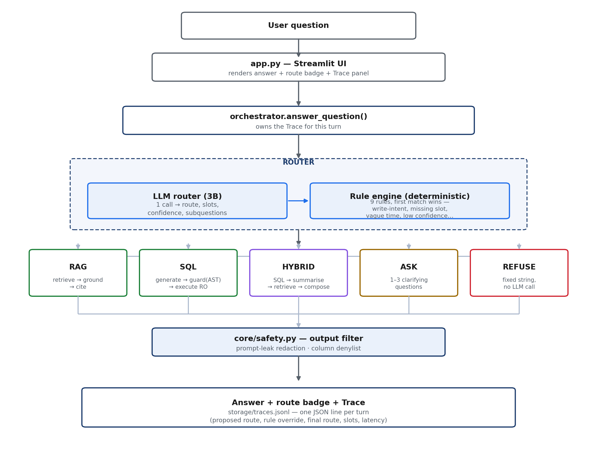

# GTM Analyst Copilot — Design Write-up

*A routed pipeline for GTM analytics questions: one question type in, one deterministic path out, every turn traced.*

---

## 1. Problem statement

GTM teams at a B2B SaaS company (sales, CS, RevOps) constantly ask two kinds of questions while working a deal: *what does the product do* (lives in enablement decks and field guides) and *what's actually happening in the pipeline* (lives in the CRM/database). Today that means digging through PDFs by hand, or pinging a data person to write a query — both slow, and neither one flags it when two source documents disagree, or when a number is being trusted without knowing where it came from.

**The GTM Analyst Copilot is a single chat interface that answers both kinds of question — and blends of the two — for an internal GTM team**, without guessing when a question is underspecified and without a number ever appearing that can't be traced back to its source. It runs entirely on the laptop (local LLMs via Ollama, on-disk vector store), a deliberate constraint given it operates over live-looking pipeline data.

Three question types share one chat box, and they fail differently:

| Type | Example | Ground truth |
|---|---|---|
| Documentary | "What deployment modes are supported?" | two product PDFs |
| Quantitative | "How many Closed Won in EMEA in 2024?" | `gtm_mock.db` |
| Both | "2024 Enterprise win rate, and what gates a deal before Commit?" | both |

A wrong doc answer is a wrong sentence someone can check. A wrong *number* gets acted on. So the design spends most of its safety budget on the numeric path, and most of its honesty budget on knowing when it doesn't have enough information to compute anything.

## 2. Architecture

**One classification, one deterministic path, one trace.** An LLM router proposes a route; a deterministic rule engine can override it. Nine rules run in fixed order, first match wins, and the firing rule ID is written into the trace — so every override is explainable after the fact, not just plausible.

| Rule | Fires when | Result |
|---|---|---|
| `R00_PII_REQUEST` | question asks for personal PII | **REFUSE** |
| `R0B_OFF_DOMAIN` | router classified the question out of scope | **REFUSE** |
| `R0_WRITE_INTENT` | delete/update/insert/drop in the question | **REFUSE** |
| `R0C_HYBRID_NO_SQL` | HYBRID proposed, no `sql_subquestion` | downgrade to **RAG** |
| `R1_MISSING_SLOT` | SQL/HYBRID missing time range or region/segment | **ASK** |
| `R1B_REGION_SCOPE` | region/segment outside the user's ACL | **REFUSE** |
| `R2_VAGUE_TIME` | "recently", "top", "best" with no explicit period | **ASK** |
| `R3_LOW_CONFIDENCE` | router confidence < 0.60 | **ASK** |

The core bet: **use the LLM for intent, never for guarantees** — a model right 90% of the time is a good router and an unacceptable safety control.

## 3. Key tradeoffs

- **Routed pipeline over ReAct.** A ReAct loop would let SQL and docs iterate on each other, but costs 3–6 local LLM calls per turn against a <10s target, and varies turn to turn. The router already splits hybrid questions into a `sql_subquestion` and a `doc_subquestion` — the only decomposition this problem needs. Lost iteration is listed as a limitation, not hidden.
- **AST allowlist over regex denylist for SQL.** A denylist loses to obfuscation (`DR/**/OP`, casing, a `DELETE` nested in a CTE). `sql/guard.py` parses with `sqlglot` and allows only one `SELECT` statement, live-introspected tables, and an explicit function allowlist; the connection itself is opened read-only as a second, independent layer.
- **Ask over assume.** On this data, "recently" changes the answer by an order of magnitude between years and regions. A confident wrong number is worse than a question, so under-specified quantitative asks route to ASK with concrete defaults the user can accept in one word.
- **RRF hybrid retrieval over dense-only.** Dense embeddings find paraphrases; BM25 finds the exact tokens (`XYZ-ANALYTICS`) embeddings blur. Reciprocal Rank Fusion needs only rank, not score, so it doesn't need re-normalising as the corpus changes.
- **Verbatim-number checking over fluency.** Every number in a generated answer must trace back to the SQL result, the question, or the executed SQL. One regeneration is allowed on failure; a second failure falls back to a verified table plus cited chunks rather than an ungrounded number.
- **Table-only rendering below 20 rows.** Factual, small results render with zero LLM calls — the single biggest latency win, at no cost to quality.

## 4. Known limitations

- **No iteration.** Hybrid runs SQL once, then docs once; it can't refine the query based on what the documents said.
- **Bounded follow-ups.** Multi-turn resolution ("and for EMEA?") only looks at the last 1–2 answered turns, and falls back to a fresh route (worst case, ASK) rather than risk a wrong merge.
- **Latency is local-hardware-bound.** Measured runs hit the <10s target on 3/5 routes when idle, 1/5 when the machine is busy — local 7B generation competes for the same RAM/GPU as everything else. A hosted-model build is the escape hatch.
- **Semantic schema drift isn't caught.** Structural drift (renamed/dropped columns) is caught by live introspection; a renamed *meaning* (e.g. `'Closed Won'` → `'Won'`) is not.
- **No row-level security.** Only a column denylist exists; the synthetic data has no per-user ownership model to enforce against.
